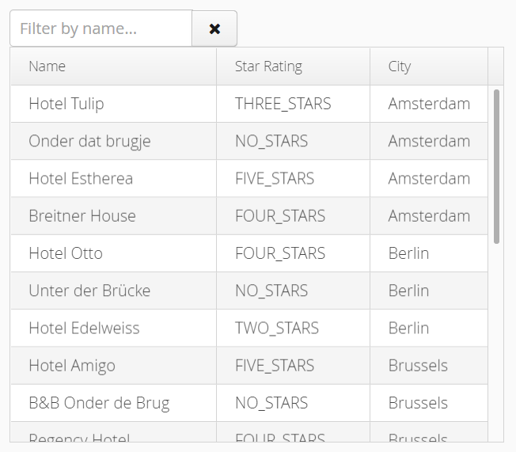

# Exercise 3 - Live filtering
Enhance the previous exercise by adding a filter `TextField` to provide live filtering on the accomodation name.

Also add a `Button` next to the filter field to clear the filter.

The look and feel in this exercise is a bit different. Notice the `@Theme` annotation on `BookingUI`. That is now set to the 'valo' theme, instead of the default 'reindeer' theme from the previous exercises.

