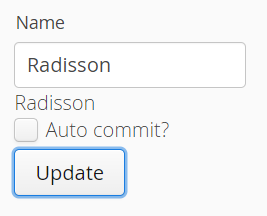

# Exercise 4 - Simple Field Binding
Create a TextField and a Label, both bound to the same 'name' Property.

Add a button to commit the field.

Clicking the button should update the Label with the value in the TextField.

**Extra credits:** 

Add a checkbox to hide the button and make the TextField auto-commit.

