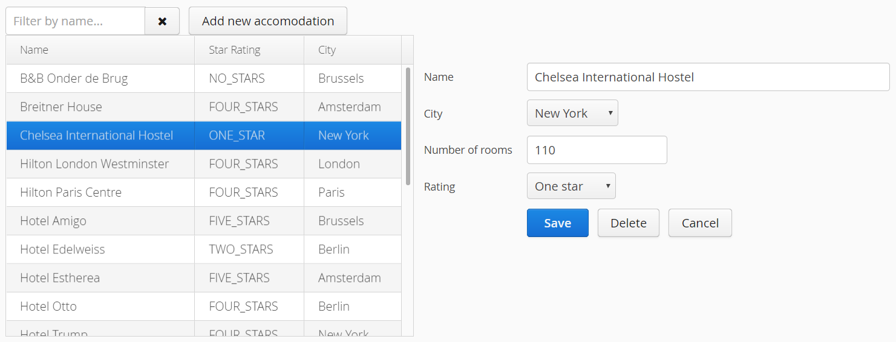

# Exercise 5 - Binding Beans

## Part 1: Adding a new Accomodation
Add a 'Add new accomodation button' that show a form to add an new Accomodation.

Create an EditAccomodationForm component by writing a new class extending `FormLayout`.

Add fields to this component for the following properties of Accomodation:
* Name
* City
* Number of rooms
* Star Rating

Add a Save button to save the entity.

Use `AccomodationService.save()` and `AccomodationService.delete()` to save or delete the entities.

Place the EditAccomodationForm component to the right of the grid.

**Note 1:** Use `BeanFieldGroup.bindFieldsUnbuffered(form, accomodation)` to bind the Accomodation bean to the Form.
Make sure to name your form fields the same as the Accomodation properties to make the binding work.

**Note 2:** To understand what the **unbuffered** in `bindFieldsUnbuffered()` means, put a breakpoint in 
Accomodation.setName(), run your Application in debug and see when you enter the breakpoint when editing the name field.
Now change your code and use `bindFieldsBuffered()`. Notice the difference.

## Part 2: Updating an existing Accomodation
When the user clicks an element in the `Grid`, open the `EditAccomodationForm` and load the selected Accomodation.

Update the entity when the user clicks save().

Use `AccomodationService.save()` to update the entity.

## Part 3: Deleting an Accomodation
Add a Delete button to delete the entity.

Use `AccomodationService.delete()` to delete the entity.

## Part 4: Add a cancel button
Add a Cancel button to the form that closes the form.

## Extra credits

Add a `DateField` to the form for the 'dateCreated' property of Accomodation.
