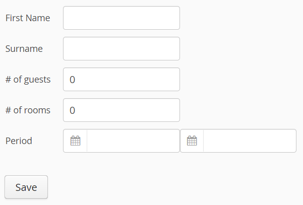

# Exercise 11 - FieldGroup, FieldFactory and Custom Fields

Create an input form to book an accomodation. 
This means creating a `Booking` and saving it using `AccomodationService.save(accomodationId, booking)`.

This time, use `BeanFieldGroup` to bind AND create the fields using a FieldFactory.

Use the custom `DateRangeField` to add the booking period to the form.

Create a custom `CustomFieldGroupFieldFactory` extending `DefaultFieldGroupFieldFactory` to generate `DateRangeField`s for DateRange properties.

After saving the `Booking`, show the Booking details using the `BookingDetailsComponent`.

